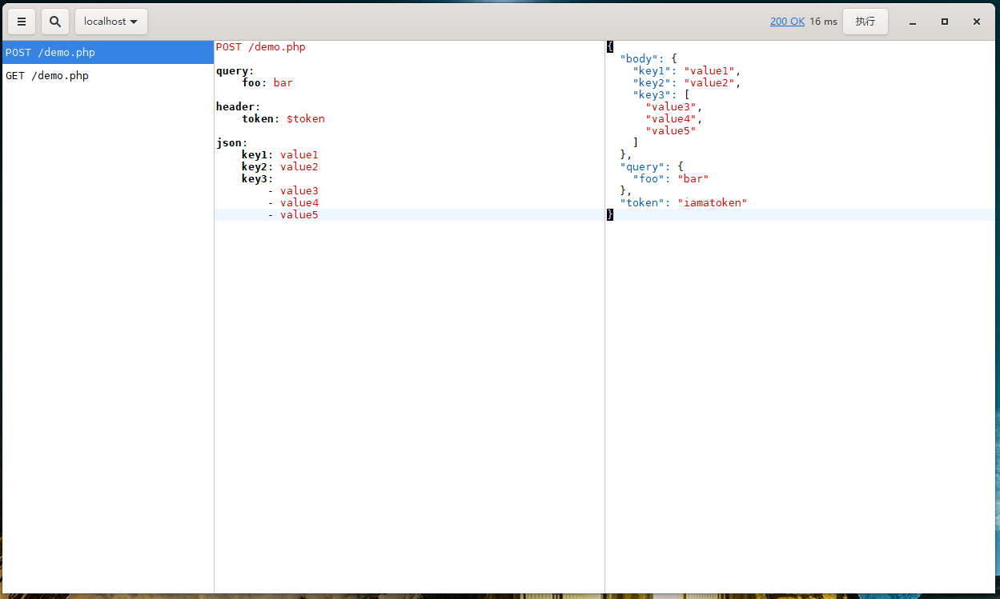

# Put

使用Rust开发的类似Postman的接口请求工具，使用Yaml来描述请求。



## 请求格式
```yaml
<method> <url>

# 查询参数
query:
  foo: bar

# 请求头
header:
  foo: bar

# application/x-www-form-urlencoded
params:
  foo: bar

# 表单
form:
  foo: bar

# application/json
json:
  foo: bar
  
# raw body
body: foobar
```

## Building

[安装gtk-rs](http://gtk-rs.org/docs/requirements.html)

克隆项目，进入src目录，执行

> cargo build --release